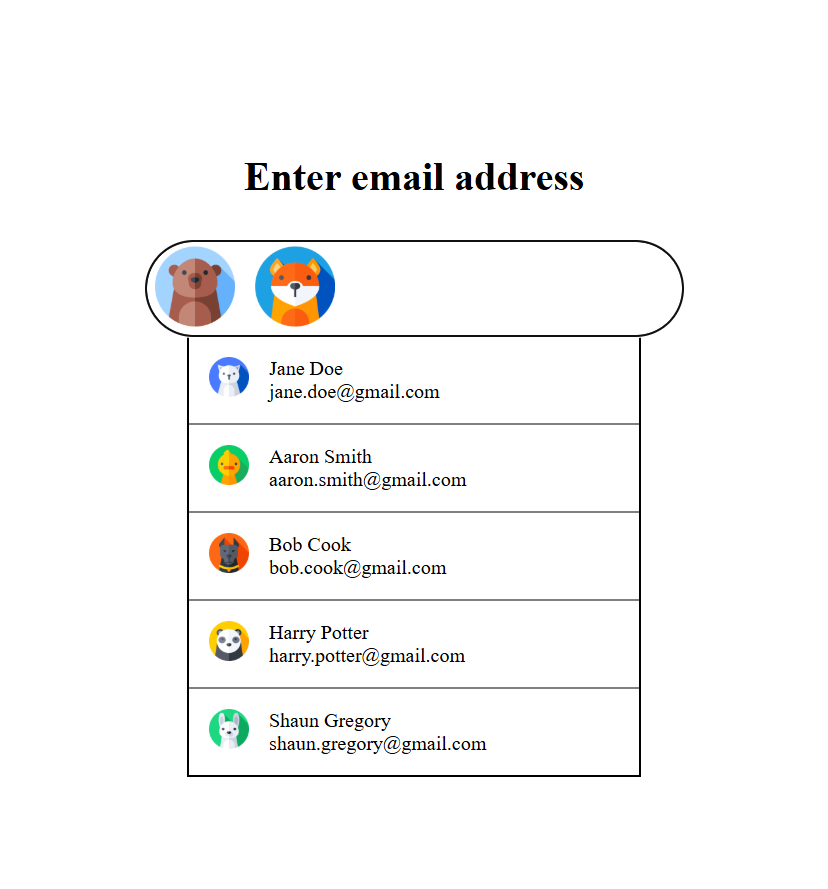

# EmailChip
Email features built using react

1. Auto suggest people when user starts typing in the input field
2. Display a list of selected people as chips with avatar

## TODO:

1. Increase the width of input field
2. Display the cursor after the chips for the selected contacts
3. Center the chip inside the input field
4. Improve margins between the chips
5. Handle overflow of chips
6. Add a functionality to remove the selected chip
